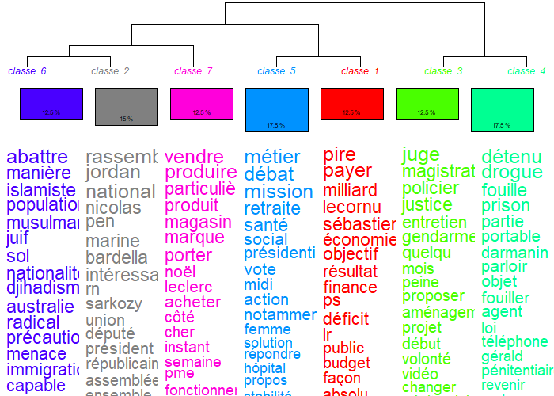

```{r setup, include = FALSE}
knitr::opts_chunk$set(
  collapse = TRUE,
  comment = "#>",
  eval = T
)
```

Cette vignette montre comment exporter un tableau de textes vers le
format attendu par IRaMuTeQ, puis comment réimporter les résultats de
classification.

Avant de faire l'export vers IRaMuTeQ, nous appliquons les corrections
sur le `df_text` (voir la vignette *Préparer les données textuelles*
pour le détail).

```{r chargement, message=FALSE}
library(lexico)
library(dplyr)
library(stringr)

df_text <- data(df_text_bfm)

stopwords <- get_specific_stopwords()
stopwords_regex <- paste0("\\b(?:", paste(stopwords, collapse = "|"), ")\\b")

df_text <- df_text %>%
  mutate(text = tolower(text),
         text = str_remove_all(text,stopwords_regex),
         text = str_replace_all(text, get_recode_words()),
         text = str_remove_all(text,"\\[[a-z]+?\\]"),
         text = str_squish(text))

df_segment <- df_text %>%
  mutate(id_segment = 1+floor(start/(2*60))) %>%
  group_by(suffix,video_id,id_segment) %>%
  summarise(start = min(start),end = max(end),
            text = paste(text, collapse = " "),
            .groups = "drop")
```

## Construire le fichier .txt pour IRaMuTeQ

`export_to_iramuteq()` attend un `data.frame` contenant au moins une
colonne texte et des colonnes de métadonnées. Chaque ligne devient un
document.

```{r export, eval = FALSE}
export_to_iramuteq(
  df = df_segment,
  meta_cols = c("video_id","id_segment"),
  text_col = "text",
  output_file = "inst/extdata/corpus_bfm.txt"
)
```

Le fichier généré contient un en-tête `****` suivi des variables
métadonnées préfixées par `*` et du texte nettoyé des retours à la
ligne.

Vous pouvez maintenant utiliser IRaMuTeQ pour traiter le corpus. Pour
l'exemple donné ci-dessus, j'ouvre IRaMuTeQ, charge le corpus en
désactivant l'option 'faire des segments de texte' car les segments ont
été fait par le minutage. Je choisis ensuite la classification par
méthode Reinert simple sur texte, pour obtenir la classification
suivante :

 

Ensuite, j'exporte le corpus afin
de récupérer la classe attribuée à chaque segment, ainsi que le rapport
pour obtenir les mots de chaque classe.

## Lire un corpus IRaMuTeQ existant

Pour récupérer le corpus IRaMuTeQ en tableau R, utilisez la fonction
`import_from_iramuteq()`. Chaque métadonnée devient une colonne ; le
texte est stocké dans `text` et la classe dans `classe` avec une classe
0 pour les segments non attribués. Attention, les tirets bas des
métadonnées sont supprimés.

```{r import}
path_corpus <- "https://github.com/tdelc/lexico/blob/master/inst/extdata/corpus_bfm/corpus_bfm_alceste_1/"
df_segment <- import_from_iramuteq(file.path(path_corpus,"export_corpus.txt"))
head(df_segment)
```

À partir du fichier `rapport.txt`, on peut récupérer la liste des mots
constitutifs de chaque classe.

```{r}
nb_classes <- length(unique(df_segment$classe))-1

df_mots <- 1:nb_classes %>% purrr:::map_df(~{
  read_iramuteq_class(file.path(path_corpus,"RAPPORT.txt"),.x) %>%
    mutate(classe = .x)
})

head(df_mots)
```

La base de données `df_segment` peut maintenant être couplée aux bases
de données `df_stat` et `df_info` pour analyser les classes selon la
date de publication, la playlist, le titre de la vidéo, etc.
